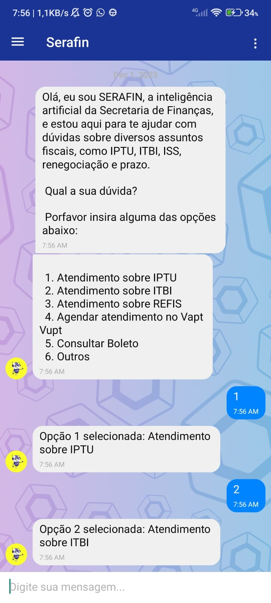

# Chatbot da Secretaria de Finanças - Juazeiro do Norte 🤖💼

## Sobre o Projeto 📝

O Chatbot da Secretaria de Finanças é uma solução inovadora desenvolvida para o Estado do Ceará, especificamente para a cidade de Juazeiro do Norte. Este aplicativo utiliza tecnologia de ponta em aprendizado de máquina e inteligência artificial 🧠, através da integração com a GPT (Generative Pre-trained Transformer) da OpenAI, para facilitar a comunicação com os cidadãos e otimizar os serviços financeiros do estado.
<p float="left">
   
   
 
 
 
 
   
   
 
</p>

## Funcionalidades 🚀

- **Emissão de Boletos**: Geração instantânea de boletos para pagamentos de taxas e impostos. 🧾
- **Consulta de Débitos**: Verificação rápida de débitos pendentes e instruções para regularização. 📊
- **Atendimento Automatizado**: Respostas imediatas para dúvidas frequentes dos cidadãos, utilizando a mais avançada tecnologia de IA. 💬

## Tecnologias Utilizadas 🛠️

- React Native
- Machine Learning
- GPT da OpenAI
- Fine Turing

## Iniciando o Projeto 🏁

Para iniciar o projeto, siga os passos abaixo:

```bash
git clone https://github.com/seuusuario/seuprojeto.git
cd seuprojeto
npm install
npm start
